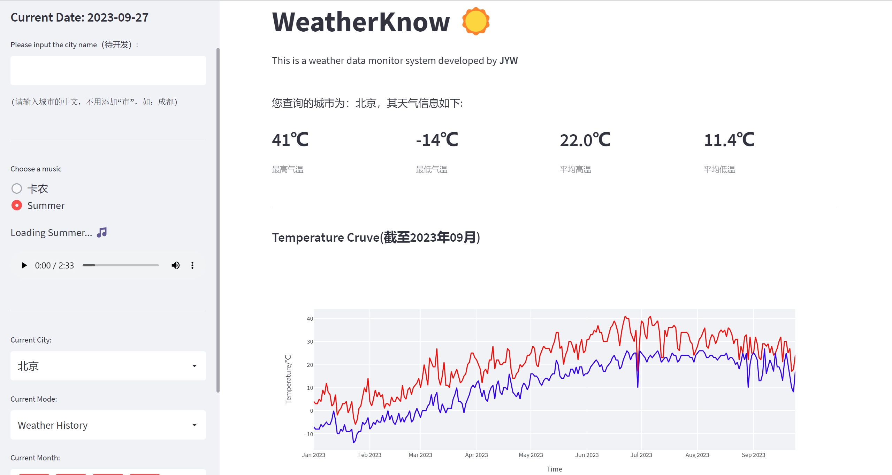

# Weather Monitor System based on Python & Streamlit
[Yuwei Jiang](https://github.com/jyw2000-jyw)* @ **Nanyang Technological University**

<a href='https://dashboard.heroku.com/apps'></a> 

## Overview


## How to use
### Installation

```
conda create -n wk python==3.8.5
conda activate wk
pip install -n requirements.txt
```

### Get weather data
```
python run weather_utils.py
```

### Run the demo

```
streamlit run WeatherKnow.py
```

## Update Blog
1. Completed the baseline (2021.6)
2. Improve UI and Web Crawler Function (2023.9.25)
